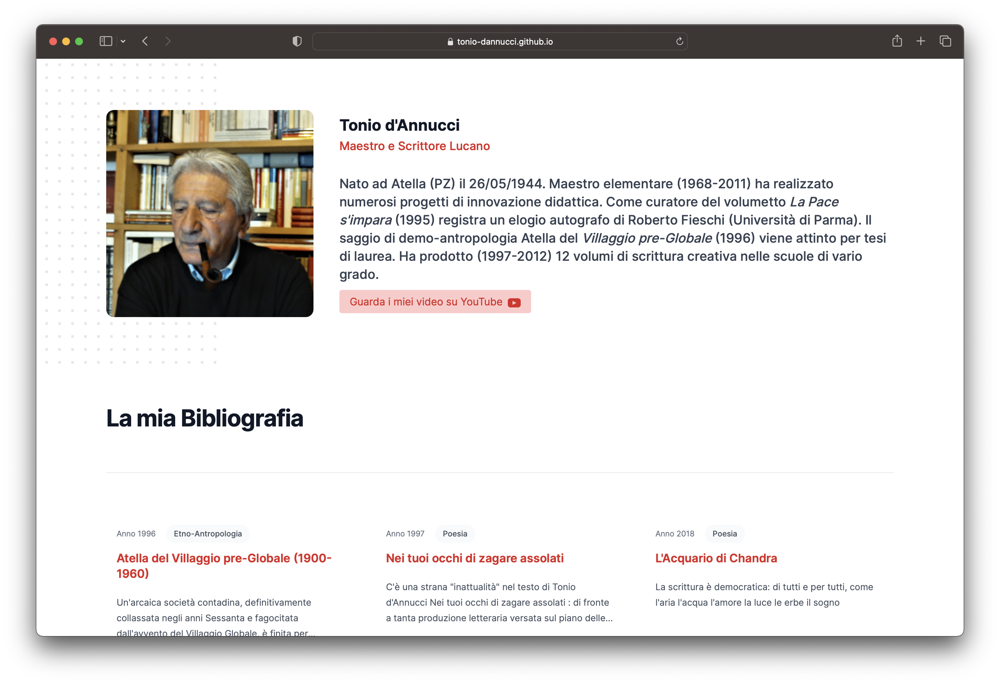

Questo è il sito del professore e maestro Tonio d'Annucci che contiene la sua biografia e le sue opere.

https://tonio-dannucci.github.io/

Il sito è stato implementato da [Ludovico Russo](https://github.com/ludusrusso) e deployato tramite github pages.

Il sito è scritto in NextJS.
